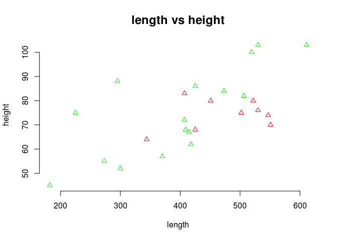

Querying from a XML file
========================

In this tutorial I am demonstrating how we could query data from xml file. This code is part of my project for a "DATA Technologies" course with Prof. Harner.

The data for this example consist of x= nave height and y = total length in feet for English medieval cathedrals. Some are in the Romanesque (r) style and others are in the Gothic (g) style. Some cathedrals have parts in both styles and are listed twice. We wish to investigate how the length is related to height for the two styles.

#### 1 Describe the design of the `cathedral.xml` file in terms of the `dataset` and `variable` elements and their meta-data.

*This dataset which is about the Cathedral(dataset) is divided to 4 sections(variable):*

-   Name of the each cathedral

-   Style of the each cathedral (r / g)

-   Height of the each cathedral

-   Length of the each cathedral

*The datasets must have a name but their role and type are optional (based on DTD file). Each variable has some values which comes with it.*

#### 2 Describe how the DTD file `dataset.dtd` is invoked. Explain the `<!ELEMENT>` declaration for each type of element in the XML design. Explain the `<!ATTLIST>` declaration for every element in the design that has one or more attributes.

``` r
# <!-- dataset DTD -->
# <!-- This DTD defines the structure for a dataset-->
# <!-- A dataset has 1 or more variables.-->
# <!ELEMENT dataset (description?, variable+)>
# <!ELEMENT description (#PCDATA)>
# <!ELEMENT variable (value+)>
# <!ELEMENT value (#PCDATA)>
# <!ATTLIST dataset
#       name CDATA #REQUIRED
#       subject CDATA #IMPLIED
#       authorization CDATA #IMPLIED
#       module CDATA #IMPLIED
# >
# <!-- Variable element has three attributes. Name identifies the variable, desc provides a description, and type indicates if the variable is numerical (num), categorical (cat), or ordinal (ord).-->
# <!-- The attribute role can take one of five values. The meaning of 'x', 'y', and 'z' is obvious. 'l' stands for label variable, 'w' stands for weight variable, and 'u' stands for undefined role. -->
# <!ATTLIST variable
#       name CDATA #REQUIRED
#       desc CDATA #IMPLIED
#       role (x|y|z|f|l|w|u) "u"
#       type (num|cat|ord) "cat"
#       levels CDATA #IMPLIED
# >
```

*This DTD file is invoked by writing the following command in `xml` file: `<!DOCTYPE dataset SYSTEM "dataset.dtd">`.This file has a root of `dataset` which is consisted of 0 or 1 occurence of description and 1 or more occurence of `variable`. Then in the next line it says that `description` is of `parsed charachter data`. In the next line it says that the `variable` is made of one or more `values`. Then in the next line it says that the `value` is of parsed charachter data.* *Then is talks about the attributes of data set which should have `name` (type CDATA) and it could have other attributes like `subject`, `authorization` and `module`, all from CDATA attributes.* *In the last Attribute list it explains the attributes of `variable` which should have the name, and then it can have other attributes like desc(CDATA), role(categorical with the `u` as a default), type(categorical with `cat` as a default) and levels(CDATA).*

#### 3 Parse `cathedral.xml` using the `xmlParse` function in the `XML` package.

``` r
#install.packages('XML')
library(XML)
cathedralDoc <- xmlParse("cathedral.xml")
# cathedralDoc
class(cathedralDoc)
```

    ## [1] "XMLInternalDocument" "XMLAbstractDocument"

Explain what the `xmlParse` function does.

*`xmlParse` based on the description of its function in R "Parses an XML or HTML file or string containing XML/HTML content, and generates an R structure representing the XML/HTML tree." By running `cathedralDoc` we could see that.*

#### 4 Extract the variable names from the file.

``` r
cathedralDocCathedralVar <- unlist(getNodeSet(cathedralDoc, "/dataset/variable/@name"), use.name=F)
cathedralDocCathedralVar
```

    ## [1] "cathedral" "style"     "height"    "length"

``` r
str(cathedralDocCathedralVar)
```

    ##  chr [1:4] "cathedral" "style" "height" "length"

Explain what the function `getNodeSet` does using the argument `/dataset/variable/@name`.

*This function is searching for all the paths which are matching with the specified above path `/dataset/variable/` and then will return the values inside the `name` attribute*

#### 5 Extract the `cathedral` names (labels) from the file.

``` r
cathedralDocCathedrals <- unlist(getNodeSet(cathedralDoc,
                                 "/dataset/variable[1]/value/text()"), use.name=F)
(cathedral <- sapply(cathedralDocCathedrals, xmlValue))
```

    ##  [1] "Durham"       "Canterbury"   "Gloucester"   "Hereford"    
    ##  [5] "Norwich"      "Peterborough" "St.Albans"    "Winchester"  
    ##  [9] "Ely"          "York"         "Bath"         "Bristol"     
    ## [13] "Chichester"   "Exeter"       "GloucesterG"  "Lichfield"   
    ## [17] "Lincoln"      "NorwichG"     "Ripon"        "Southwark"   
    ## [21] "Wells"        "St.Asaph"     "WinchesterG"  "Old.St.Paul" 
    ## [25] "Salisbury"

``` r
str(cathedral)
```

    ##  chr [1:25] "Durham" "Canterbury" "Gloucester" "Hereford" ...

Explain what the function `getNodeSet` does using the argument `/dataset/variable[1]/value/text()`.

*This time since we want to know about the variables not the attributes so we shouldn't use @ value, instead we use the 'text()' function. Another difference with the previous one is that here we need to just search in the first variable not the others so we use '\[1\]'. So we go through '/dataset/variable\[1\]/value/' and take the values by 'text()'. Here we should also do one more step to transorm the values completely from xml to R which can be done by applying `xmlvalue` function on our previous result using `sapply` function.*

#### 6 Extract the cathedral `style` variable from the file.

``` r
cathedralStyle <- unlist(getNodeSet(cathedralDoc,"/dataset/variable[2]/value/text()"))
(cathedralStyle <- sapply(cathedralStyle,xmlValue))
```

    ##  [1] "r" "r" "r" "r" "r" "r" "r" "r" "r" "g" "g" "g" "g" "g" "g" "g" "g"
    ## [18] "g" "g" "g" "g" "g" "g" "g" "g"

``` r
str(cathedralStyle)
```

    ##  chr [1:25] "r" "r" "r" "r" "r" "r" "r" "r" "r" ...

#### 7 Extract the cathedral `height` and `length` variables from the file.

``` r
cathedralHeight <- unlist(getNodeSet(cathedralDoc,"/dataset/variable[3]/value/text()"))
(cathedralHeight <- sapply(cathedralHeight,xmlValue))
```

    ##  [1] "75.0"  "80.0"  "68.0"  "64.0"  "83.0"  "80.0"  "70.0"  "76.0" 
    ##  [9] "74.0"  "100.0" "75.0"  "52.0"  "62.0"  "68.0"  "86.0"  "57.0" 
    ## [17] "82.0"  "72.0"  "88.0"  "55.0"  "67.0"  "45.0"  "103.0" "103.0"
    ## [25] "84.0"

``` r
cathedralLenght <- unlist(getNodeSet(cathedralDoc,"/dataset/variable[4]/value/text()"))
(cathedralLenght <- sapply(cathedralLenght,xmlValue))
```

    ##  [1] "502.0" "522.0" "425.0" "344.0" "407.0" "451.0" "551.0" "530.0"
    ##  [9] "547.0" "519.0" "225.0" "300.0" "418.0" "409.0" "425.0" "370.0"
    ## [17] "506.0" "407.0" "295.0" "273.0" "415.0" "182.0" "530.0" "611.0"
    ## [25] "473.0"

#### 8 Construct a `data.frame` with the `cathedral` as the first column, `style` (coerced to a factor) as the second column, `height` (coerced to numeric) as the third column, etc.

``` r
(cathedral.df <- data.frame( cathedral = cathedral, style = as.factor(cathedralStyle), height= as.numeric(cathedralHeight)))
```

    ##       cathedral style height
    ## 1        Durham     r     75
    ## 2    Canterbury     r     80
    ## 3    Gloucester     r     68
    ## 4      Hereford     r     64
    ## 5       Norwich     r     83
    ## 6  Peterborough     r     80
    ## 7     St.Albans     r     70
    ## 8    Winchester     r     76
    ## 9           Ely     r     74
    ## 10         York     g    100
    ## 11         Bath     g     75
    ## 12      Bristol     g     52
    ## 13   Chichester     g     62
    ## 14       Exeter     g     68
    ## 15  GloucesterG     g     86
    ## 16    Lichfield     g     57
    ## 17      Lincoln     g     82
    ## 18     NorwichG     g     72
    ## 19        Ripon     g     88
    ## 20    Southwark     g     55
    ## 21        Wells     g     67
    ## 22     St.Asaph     g     45
    ## 23  WinchesterG     g    103
    ## 24  Old.St.Paul     g    103
    ## 25    Salisbury     g     84

``` r
str(cathedral.df)
```

    ## 'data.frame':    25 obs. of  3 variables:
    ##  $ cathedral: Factor w/ 25 levels "Bath","Bristol",..: 5 3 8 10 13 16 20 23 6 25 ...
    ##  $ style    : Factor w/ 2 levels "g","r": 2 2 2 2 2 2 2 2 2 1 ...
    ##  $ height   : num  75 80 68 64 83 80 70 76 74 100 ...

#### 9 Plot `length` vs. `height` and color points by `style`. You will need to convert `style` to a factor and `length` and `height` to numeric vectors. Hint: look at the `text` function.

``` r
str(cathedralStyle)
```

    ##  chr [1:25] "r" "r" "r" "r" "r" "r" "r" "r" "r" ...

``` r
length <- as.numeric(cathedralLenght)
height <-as.numeric(cathedralHeight)
plot(length, height, xlab="length", ylab="height", main="length vs height", pch=2, cex.main=1.5, frame.plot=FALSE, col=ifelse(cathedralStyle =="r", "red", "green"))
```



Describe group differences in this plot.

*It can be inferred from the plot that the `r` style which are in red color are closer to each other in terms of height and length in comparison to the `g` style which are in green color. On other words, although the means of height and length seems to be similar but the variances are different*

#### 10 Test (univariately and bivariately) if there is difference between styles based on `height` and `length`. Hint: look at the manova function.

``` r
cathedralDocStyle<- unlist(getNodeSet(cathedralDoc, "/dataset/variable[2]/value/text()"),
                           use.name=F)
style <- sapply(cathedralDocStyle, xmlValue)
cathedralDF <- data.frame(cathedral, style = as.factor(style), height = as.numeric(height), length = as.numeric(length))
cathedral.manova <- manova(cbind(length, height) ~ style, data=cathedralDF)
summary(cathedral.manova)
```

    ##           Df  Pillai approx F num Df den Df  Pr(>F)  
    ## style      1 0.21985   3.0999      2     22 0.06516 .
    ## Residuals 23                                         
    ## ---
    ## Signif. codes:  0 '***' 0.001 '**' 0.01 '*' 0.05 '.' 0.1 ' ' 1

``` r
summary.aov(cathedral.manova)
```

    ##  Response length :
    ##             Df Sum Sq Mean Sq F value  Pr(>F)  
    ## style        1  35106   35106  3.2127 0.08623 .
    ## Residuals   23 251326   10927                  
    ## ---
    ## Signif. codes:  0 '***' 0.001 '**' 0.01 '*' 0.05 '.' 0.1 ' ' 1
    ## 
    ##  Response height :
    ##             Df Sum Sq Mean Sq F value Pr(>F)
    ## style        1    1.4    1.40   0.006 0.9389
    ## Residuals   23 5365.2  233.27

Comment on the resulting tests relative to the graph in question 9.

The bivariate test shows near significance (P-value = 0.065) between g and r style cathedrals along the length and height dimensions. The corresponding univariate tests show near significance (at the 0.05 level) for length, but no diffence for height. These tests assume equality of variances, or covariance matrices in the bivariate case, which are questionable assumptions as can be seen in the plot.
